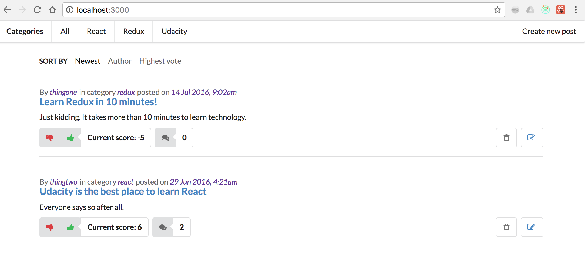

# Readable Project

This is my submission for the project Readable from Udacity's React Developer Nanodegree. In this app users are able to post content to predefined categories, comment on their posts and other users' posts, and vote on posts and comments. Users are also be able to edit and delete posts and comments.

## Starting the application

To run the frontend you will have to run the backend first. The backend server is provided by Udacity in this [repo](https://github.com/udacity/reactnd-project-readable-starter) and running is a simple `npm install` followed by a `npm run`.

In order to run the frontend check out this repository

```
bash$ git clone https://github.com/mentlsve/reactnd-project-readable
bash$ cd reactnd-project-readable
bash$ npm install
bash$ npm start
```

You can access the application at `http://localhost:3000` then and should see the following UI


